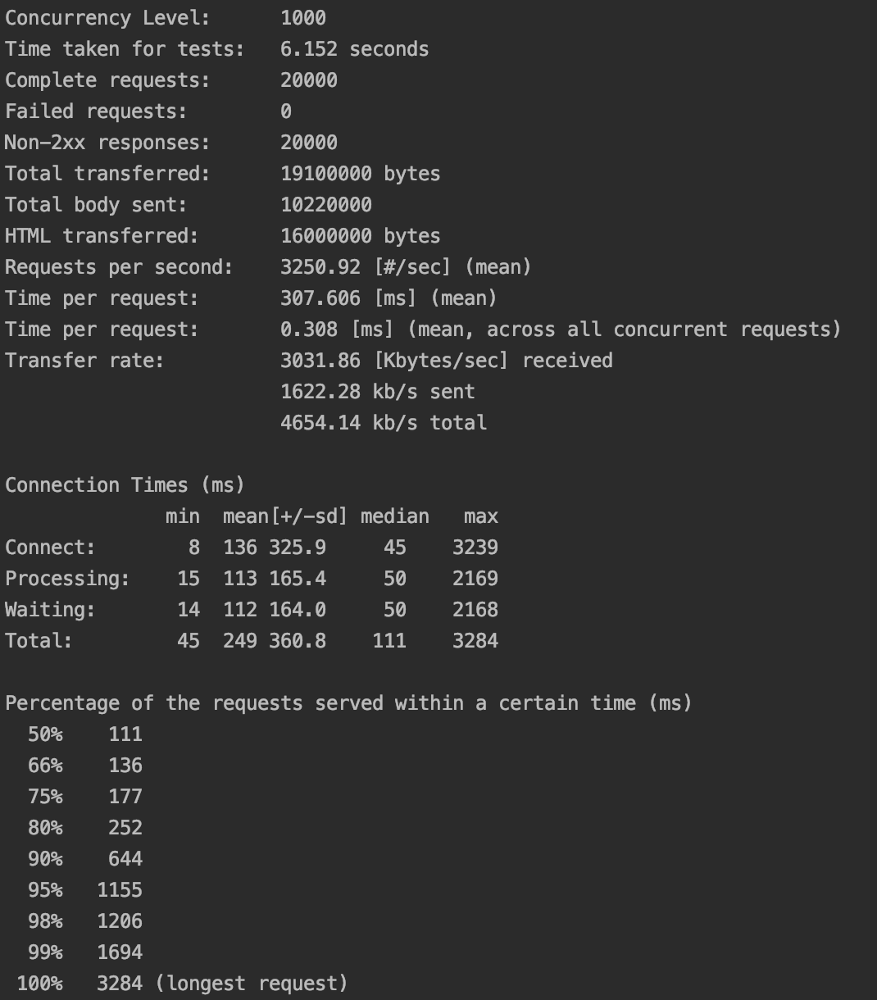

## 怎么用Apache Benchmarking进行压力测试?

### 执行如下命令，测试总共2万请求，并发1000请求的情况：
```
git clone http://192.168.0.240:9990/DevelopmentTwo/microservice/stress-test.git
cd stress-test
ab -p ./config/userinfo.txt -T 'multipart/form-data; boundary=1234567890' -H 'Basic bWFuYWdlci1wb3J0YWw6MTIzNDU=' -n 20000 -c 1000 http://192.168.0.242:9999/oauth/token
```

### 在一台授权服务器，没有缓存和Load Balancing的测试环境中，测试结果如下：
* 针对80%的请求，请求时间252毫秒；
* 针对90%的请求，请求时间644毫秒；
* 最长请求时间是3284毫秒。




## 怎么用Taurus进行压力测试?

### 执行如下命令，测试并发1000请求，1分钟启动，5分钟持续1000并发量的情况：
```
git clone http://192.168.0.240:9990/DevelopmentTwo/microservice/stress-test.git
cd stress-test
bzt ./config/quick_test.yml
```

### Taurus的实时显示和测试结果如下：


## 怎么用Gatling进行压力测试?

### 执行如下命令，测试每30秒增加100并发用户，总共这样增加用户100次，并持续最大并发用户数5分钟：
```
mvn clean gatling:test
```

### 测试报告在哪里

Gatling可以提供HTML格式的测试报告，而测试报告可以在当前运行目录的"/target/gatling/{simulation-timestamp}/index.html"里看到。

### 测试报告样例


## 怎么用Locust进行压力测试?

### 怎么安装Locust?
```
pip install locustio
```

### 执行如下命令，启动Locust测试，启动后访问http://localhost:8089/ 设置并发用户：
```
git clone http://192.168.0.240:9990/DevelopmentTwo/microservice/stress-test.git
cd stress-test
locust -f ./config/locustfile.py
```

### 测试报告样例


